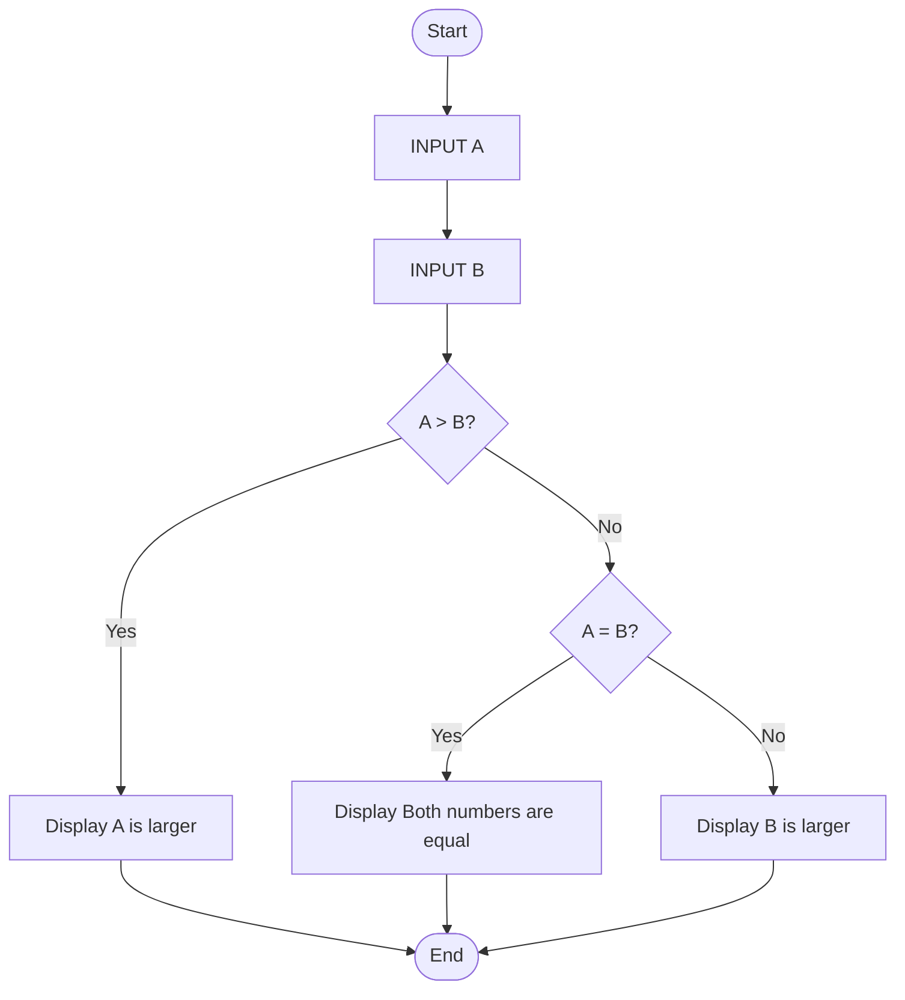
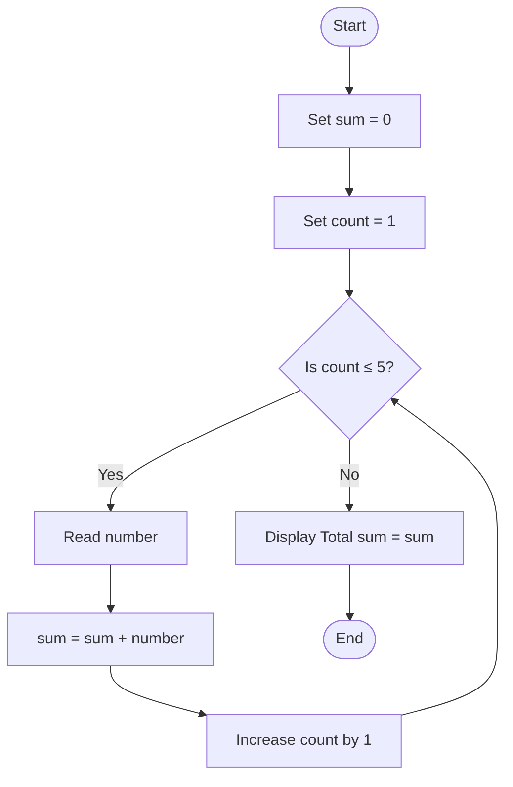
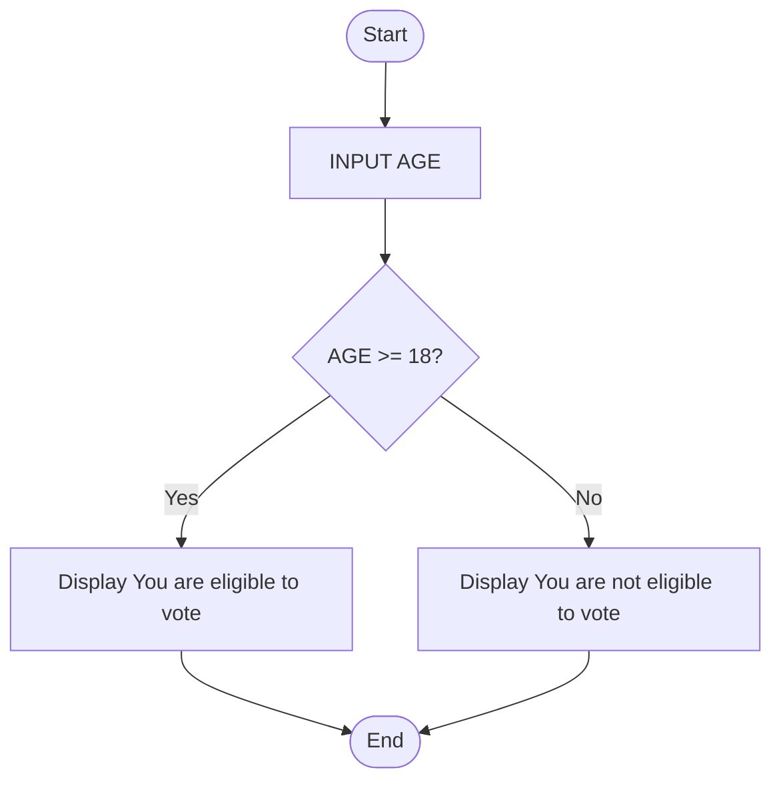
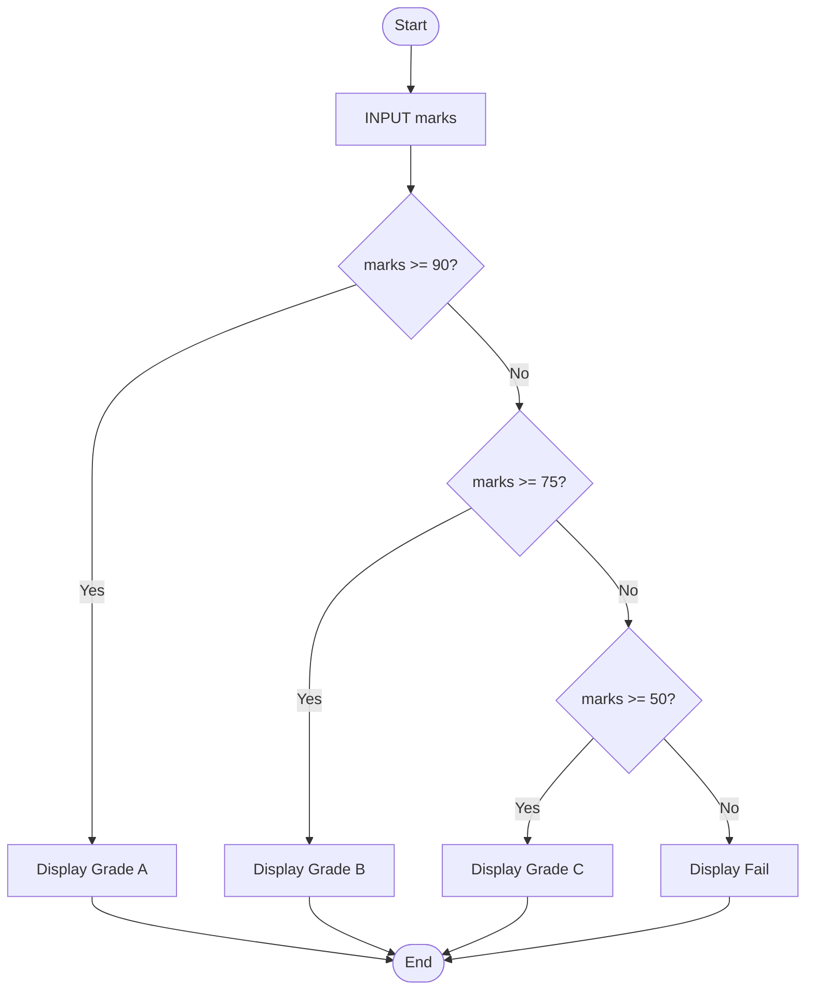

# Exercise: Algorithm and flowchart

## Exercise 1
Find the Largest of Two Numbers

Write a program that:
- Takes two numbers **A** and **B** as input
- Compare the two numbers
- Display which number is larger
- if they are equal, display: **Both numbers are equal**

## Pseudocode
 
```text
START
    INPUT A
    INPUT B

    IF A > B THEN
        DISPLAY "A is larger"
    ELSE IF B > A THEN
        DISPLAY "B is larger"
    ELSE
        DISPLAY "Both numbers are equal"
    ENDIF
END
```

## Flowchart



## Exercise 2
Sum of 5 Numbers ( Loop + Accumulation)

Write pseudocode for a program that:
- Read 5 numbers one by one
- calculate theor total sum
- Display the results


## Pseudocode

```text
START
    SET sum ← 0

    FOR count ← 1 TO 5 DO
        DISPLAY "Enter number ", count
        READ number
        sum ← sum + number
    END FOR

    DISPLAY "Total sum = ", sum
END
```

## Flowchart


## Exercise 3
Voting Eligibility Check

Write a program that:
- Takes the user's age as input
- If the age is 18 or older, display "You are eligible to vote"
- If the age is less than 18, display "You are not eligible to vote"

## Pseudocode

```text
START
    INPUT AGE

    IF AGE >= 18 THEN
        DISPLAY "You are eligible to vote"
    ELSE
        DISPLAY "You are not eligible to vote"
    ENDIF
END
```

## Flowchart


## Exercise 4
Student Grade Calculator

Write a program that:
- Takes a student's marks (out of 100) as input
- If marks are 90 or above, display "Grade A"
- If marks are between 75 and 89, display "Grade B"
- If marks are between 50 and 74, display "Grade C"
- If marks are below 50, display "Fail"

## Pseudocode

```text
START
    INPUT marks

    IF marks >= 90 THEN
        DISPLAY "Grade A"
    ELSE IF marks >= 75 THEN
        DISPLAY "Grade B"
    ELSE IF marks >= 50 THEN
        DISPLAY "Grade C"
    ELSE
        DISPLAY "Fail"
    ENDIF
END
```

## Flowchart



## Exercise 5
A program takes three numbers (A, B, C ) as input:
- Dtermine which number is the largest
- Display the largest number
- End the program

```text
START
    DISPLAY "Enter number A:"
    READ A

    DISPLAY "Enter number B:"
    READ B

    DISPLAY "Enter number C:"
    READ C

    IF A >= B AND A >= C THEN
        DISPLAY "Largest number is A =", 

    ELSE IF B >= A AND B >= C THEN
        DISPLAY "Largest number is B =", B

    ELSE
        DISPLAY "Largest number is C =", C
    END IF

END
```
```mermaid
flowchart TD

    A([Start]) --> B[Read A]
    B --> C[Read B]
    C --> D[Read C]

    D --> E{A >= B AND A >= C?}
    E -->|Yes| F[Display "A is the largest"]
    E -->|No| G{B >= A AND B >= C?}

    G -->|Yes| H[Display "B is the largest"]
    G -->|No| I[Display "C is the largest"]

    F --> J([End])
    H --> J
    I --> J
```
