# Exercise: Algorithm and flowchart

## Exercise 1
Find the Largest of Two Numbers

Write a program that:
- Takes two numbers **A** and **B** as input
- Compare the two numbers
- Display which number is larger
- if they are equal, display: **Both numbers are equal**

## Pseudocode
 
```text
START
    INPUT A
    INPUT B

    IF A > B THEN
        DISPLAY "A is larger"
    ELSE IF B > A THEN
        DISPLAY "B is larger"
    ELSE
        DISPLAY "Both numbers are equal"
    ENDIF
END
```

## Flowchart


## Exercise 2
Sum of 5 Numbers ( Loop + Accumulation)

Write pseudocode for a program that:
- Read 5 numbers one by one
- calculate theor total sum
- Display the results


## Pseudocode

```text
START
    SET sum ← 0

    FOR count ← 1 TO 5 DO
        DISPLAY "Enter number ", count
        READ number
        sum ← sum + number
    END FOR

    DISPLAY "Total sum = ", sum
END
```

## Flowchart


```mermaid
flowchart TD

    A([Start]) --> B[Set sum = 0]
    B --> C[Set count = 1]
    C --> D{Is count ≤ 5?}

    D -->|Yes| E[Read number]
    E --> F[sum = sum + number]
    F --> G[Increase count by 1]
    G --> D

    D -->|No| H[Display Total sum = sum]
    H --> I([End])
```

## Exercise 3
Voting Eligibility Check

Write a program that:
- Takes the user's age as input
- If the age is 18 or older, display "You are eligible to vote"
- If the age is less than 18, display "You are not eligible to vote"

## Pseudocode

```text
START
    INPUT AGE

    IF AGE >= 18 THEN
        DISPLAY "You are eligible to vote"
    ELSE
        DISPLAY "You are not eligible to vote"
    ENDIF
END
```

## Flowchart


