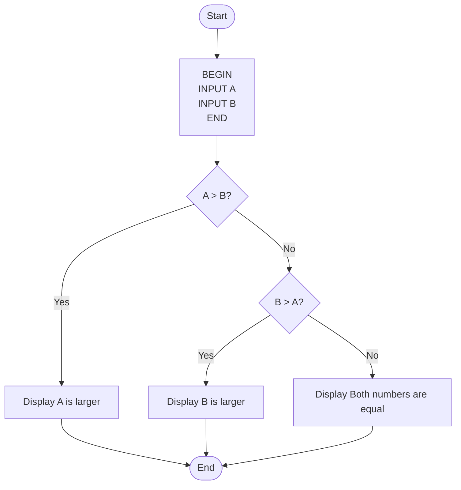

# Exercise: Algorithm and flowchart

## Exercise 1
Find the Largest of Two Numbers

Write a program that:
- Takes two numbers **A** and **B** as input
- Compare the two numbers
- Display which number is larger
- if they are equal, display: **Both numbers are equal**

## Pseudocode
 
    START
        INPUT A

        INPUT B

        IF A > B THEN
            DISPLAY "B is larger"
        ELSE IF A == B
            DISPLAY "Both numbers are equal"
        ELSE
            DISPLAY "B is larger"
        ENDIF

    END

## Flowchart



## Exercise 2
Sum of 5 Numbers ( Loop + Accumulation)

Write pseudocode for a program that:
- Read 5 numbers one by one
- calculate theor total sum
- Display the results


## Pseudocode

```text
START
    SET sum ← 0

    FOR count ← 1 TO 5 DO
        DISPLAY "Enter number ", count
        READ number
        sum ← sum + number
    END FOR

    DISPLAY "Total sum = ", sum
END
```

## Flowchart

```
